# This repository is a TIL created during an internship at [SL Corporation](http://www.slworld.com/).

     

## Jan.
### 1월 한줄 요약 : 미정

   

### 날짜별 정리

1월 날짜별 자세히 보기

   
### 1/31 ()
--- 
#### already did
3. 이코테 DFS&BFS
   - DFS&BFS 포스팅 마무리
   - DFS&BFS 예제 이해하기
     - DFS&BFS 예제 각각 1문제 -> 총 2문제
     - 음료수 얼려 먹기(dfs) 1문제
     - 미로 찾기(bfs) 1문제
   - [DFS&BFS 기본문제 1문제씩](https://cafe.naver.com/startdevelopercareer?iframe_url_utf8=%2FArticleRead.nhn%3FreferrerAllArticles%3Dtrue%26clubid%3D30372458%26articleid%3D6)
     - [단지 번호 붙이기](https://www.acmicpc.net/problem/2667) DFS풀이 + BFS 풀이.

#### should do
1. 이코테 DFS 파트 포스팅 하기 (~01/E)

   
### 1/30 (월)
--- 
#### already did
1. H-Mobility Class
   - 1차 교육
     - 공통/인지/판단 강의 수강 & 이해도 평가 完
2. mAP 포스팅 마무리 完
   - AP 값 구하는 보간법 부분 링크로 대체(너무 루즈해져서..)
3. 이코테 DFS 포스팅
   - 음료수 얼려 먹기 문제 code 이해 안되서 마무리 못함.
4. 기획팀 노트북 수령&불출

#### should do
1. 이코테 DFS 파트 포스팅 하기 (~01/E)

   
### 1/26 (목), 1/27 (금)
--- 
#### already did
1. H-Mobility Class
   - 자율주행 자동차 판단 기술 (심화) 수강 完
   - 노션 정리 중
2. 고려아카데미 공차설계
   - 과제 + 시험 完

#### should do
동일

   
### 1/20 (금), 1/25 (수)
--- 
#### already did
1. FER Frame 추출 code 돌리는 것 完
   - SL mobilenetV2 기반으로 다시 한번 돌리기 (민규 사원님이 진행 完)
   - PRLab VS SL 결과 상이함.
     - PRLab에서 검토 진행(코드&설명자료 정리 후 전달)
2. H-Mobility Class
   - 자율주행 자동차 판단 기술 (기초) 수강 完

#### should do
1. mAP 포스팅 마무리 (~01/E)
2. 이코테 DFS 파트 포스팅 하기 (~01/E)
3. H-Mobility 수강 완료 하기 (~01/27)
   - 노션에 정리하기(~01/E)
4. FER Frame 추출 (상명대 건, ~01/E)

   
### 1/19 (목)
--- 
#### already did
1. FER Frame 추출 code 돌리는 것 完
   - 흥용 책임님 결론에 필요한 근거 비교frame 추출
     - 남은 1명 완료.
     - `08. ㅈㅅㅇ` 님, 동일성 확인을 위한 2차 프레임 추출 完 
       - SL 자체 모델과 결과 비교해봤는데 이상함
         - SL mobilenetV2 기반으로 다시 한번 돌리기

#### should do
동일

   
### 1/18 (수)
--- 
#### already did
1. FER Frame 추출 code 돌리는 것 完
   - 흥용 책임님 결론에 필요한 근거 비교frame 추출 중 (1명 남음)

#### should do
동일

   
### 1/17 (화)
--- 
#### already did
1. FER Frame 추출 code 돌리는 중
   - 10명 정도 남음. 내일 완성 가능.
2. H-Mobility **(목표)**
   - 노션정리
     - 자율주행 자동차 인지 기술 (기초) ~24차시까지 完
   - 강의수강
     - 자율주행 자동차 판단 기술 (기초) ~13차시까지 完

#### should do
동일

   
### 1/16 (월)
--- 
#### already did
1. FER Frame 추출 code 돌리는 중
2. H-Mobility 노션 정리
   - 자율주행 자동차 인지 기술 (기초) ~12차시 完 

#### should do
동일

   
### 1/13 (금)
--- 
#### already did
1. FER Frame 추출 code 작성 完
   - 소스코드 경로 : `/TIL/Internship/DMS2_SMU/FER-0~50.mp4.ipynb/FER-0~50.mp4.ipynb`
2. H-Mobility 노션 정리
   - 자율주행 자동차 기술 이해(공통) 完 

#### should do
1. mAP 포스팅 마무리 (~01/E)
2. 이코테 DFS 파트 포스팅 하기 (~01/E)
3. H-Mobility 수강 완료 하기 (~01/E)
   - 노션에 정리하기(~01/E)
4. FER Frame 추출 (상명대 건, ~01/13)
   - 월요일에 출근해서 Emotion 8classes에 대한 Valence 작성
   - 흥용 책임님 메일에 기준 작성 되어있으니 참고.

   
### 1/12 (목)
--- 
#### already did
1. FER Frame 추출 code 작성 중
   - FaceDetection 안되면 커널 죽는 오류 해결 중

#### should do
1. 동일

   
### 1/12 (목)
--- 
#### already did
1. FER Frame 추출 code 작성 중
   - dms2 가상환경 작업 완료
2. H-Mobility 수강
   - 인지 기술 (심화) 完
   - 판단 기초/심화 남음.

#### should do
1. 동일

   
### 1/11 (수)
--- 
#### already did
1. FER Frame 추출 code 작성 중
   - 상명대 .h5 파일 활용 및 44명 데이터에 관한 Emotions, Valence 데이터를 .csv로 출력하는 것이 목표
   - `Internship/DMS2/readme.md` 에서 필요한 내용 있음
2. H-Mobility 수강
   - 인지 기술 (심화), ~12차시 完

#### should do
1. mAP 포스팅 마무리 (~01/E)
2. 이코테 DFS 파트 포스팅 하기 (~01/E)
3. H-Mobility 수강 완료 하기 (~01/E)
4. FER Frame 추출 (상명대 건, ~01/13)

   
### 1/9 (월), 1/10 (화)
--- 
#### already did
1. AR CMS Frame 추출 code 작성 完
   - 태동 선임 Feedback(cap.set(-,-))기반 code 작성 完
2. H-Mobility 수강
   - 인지 기술 (심화), ~8차시 完

#### should do
1. mAP 포스팅 마무리 (~01/08)
2. 이코테 DFS 파트 포스팅 하기 (~01/08)
3. H-Mobility 수강 완료 하기 (~01/E)

   
### 1/4 (수), 1/5 (목), 1/6(금)
--- 
#### already did
1. 잡일 하다가 시간 많이 지체됨(Excel 작업 + 물품 수령 + 노트북 교체 등)
2. AR CMS Frame 추출 코드 작성 중.
    - 뭐가 문제인지 모르겠음..(01/09 찾은 이유 : 전체 프레임 기준으로 다 확인하니까 3번파일 프레임인데 1번 파일에도 적용시켜서 그렇게 됨.)
    - 코드 한번 날아감.

#### should do
1. mAP 포스팅 마무리 (~01/08)
2. 이코테 DFS 파트 포스팅 하기 (~01/08)
3. H-Mobility 수강 완료 하기 (~01/E)
4. AR CMS Frame 추출 관련 코드 작성(~01/11)

   
### 1/4 (수)
--- 
#### already did
1. H-Mobility 수강 중
   - 공통 完
   - 인지 기초 3/5 完
2. AR CMS Frame 추출 관련 싱크 맞추기
   - 흥용 책임님 excel file 기반 / 태동 선임님 .py file baseline

#### should do
1. mAP 포스팅 마무리 (~01/08)
2. 이코테 DFS 파트 포스팅 하기 (~01/08)
3. H-Mobility 수강 완료 하기 (~01/E)
4. AR CMS Frame 추출 관련 싱크 맞추기(~01/06)

   
### 1/3 (화)
--- 
#### already did
1. H-Mobility 수강 중
   - 공통 完
   - 인지 기초 1/2 完

#### should do
1. mAP 포스팅 마무리 (~01/08)
2. 이코테 DFS 파트 포스팅 하기 (~01/08)
3. H-Mobility 수강 완료 하기 (~01/E)

   
### 1/2 (월)
--- 
#### already did
1. 코너케이스 프레임 싱크 맞추기 完
   - LH / RH 정리 후 메일 송부 完

#### should do
1. mAP 포스팅 마무리
2. 이코테 DFS 파트 포스팅 하기
3. H-Mobility 수강 완료 하기

   

## Dec.
### 12월 한줄 요약 : Detectron2 + 프레임 추출 ~~(추후수정)~~

   

### 날짜별 정리

12월 날짜별 자세히 보기

   
### 12/27 (화), 12/28 (수), 12/29 (목), 1/2 (월)
--- 
#### already did
1. AR_CMS 데이터셋 오/미인식 사례 frame별 검출 중
   - LH / RH 完
2. 코너케이스 프레임 싱크 맞추기 完
   - LH / RH 정리 후 메일 송부 完

#### should do
동일

   
### 12/26 (월)
--- 
#### already did
1. AR_CMS 데이터셋 오/미인식 사례 frame별 검출 중
   - 11/18, 19, 20, 21, 22, 23, 24 half RH 完

#### should do
1. mAP 포스팅 마무리
2. 이코테 DFS 파트 포스팅 하기
3. DMS AR(BMW POC B) Dataset 구축 / CV22 출력 기반 코너케이스 추출
   - 팟 플레이어 재생 대기중 이슈 관련 프레임 싱크 맞추기 (양식 다시 주신대)
     

   
### 12/23 (금)
--- 
#### already did
1. IoU 포스팅 마무리(그림만 수정) 完
2. AR_CMS 데이터셋 오/미인식 사례 frame별 검출 중
   - 11/18, 19, 20, 21, 22, 23half RH 完

#### should do
1. mAP 포스팅 마무리
2. 이코테 DFS 파트 포스팅 하기
3. DMS AR(BMW POC B) Dataset 구축 / CV22 출력 기반 코너케이스 추출
   - 팟플레이어 재생대기중 이슈 관련 프레임 싱크 맞추기
     - 흥용 책임님이 주신 template 수식 및 접근 방식 잘못된듯
       - 대안 : 직접 대조해야될 듯.

   
### 12/20 (화), 12/21 (수), 12/22 (목)
--- 
#### already did
1. AR_CMS 데이터셋 오/미인식 사례 frame별 검출 중
   - 11/18, 19, 20, 21 RH 完
   - 11/22 RH 진행중 

#### should do
동일

   
### 12/19 (월)
--- 
#### already did
1. AR_CMS 데이터셋 오/미인식 사례 frame별 검출 중
   - 11/18 RH 完
   - 11/19 RH 진행중
2. 이코테 DFS(스택, 큐, 재귀함수) 포스팅 

#### should do중
1. mAP 포스팅 마무리
2. IoU 포스팅 마무리 (그림 부분만 수정할 것)
3. 이코테 DFS 파트 포스팅 하기
4. AR_CMS 데이터셋 오/미인식 사례 frame별 검출하기
   - 하루에 1일.mp4 정도 될 것임.
   - 11월 18일 ~ 24일 / RH

   
### 12/15, 12/16 (목, 금)
--- 
#### 평촌 출장
1. 증강현실 특허 워크샵 참석
2. 상명대학교 DMS2 중간보고 및 회의
3. 팀회식(빕스+크레이지)

   
### 12/14 (수)
--- 
#### already did
1. AR_CMS 데이터셋 오/미인식 사례 frame별 검출중

#### should do
1. mAP 포스팅 마무리
2. IoU 포스팅 마무리 (그림 부분만 수정할 것)
3. 이코테 DFS 파트 포스팅 하기
4. AR_CMS 데이터셋 오/미인식 사례 frame별 검출하기
   - 하루에 1일.mp4 정도 될 것임.

   
### 12/13 (화)
--- 
#### already did
1. 이코테 구현 파트 포스팅 完

#### should do
1. mAP 포스팅 마무리
2. IoU 포스팅 마무리 (그림 부분만 수정할 것)
3. 이코테 DFS 파트 포스팅 하기
4. AR_CMS 데이터셋 오/미인식 사례 frame별 검출하기
   - 하루에 1일.mp4 정도 될 것임.

   
### 12/12 (월)
--- 
#### already did
1. 이코테 파이썬 문법 ~ 그리디 알고리즘 복습 완료.
   - 잘못된 부분 수정 + 내손으로 끝까지 푸는 좋은 시간이였음.
   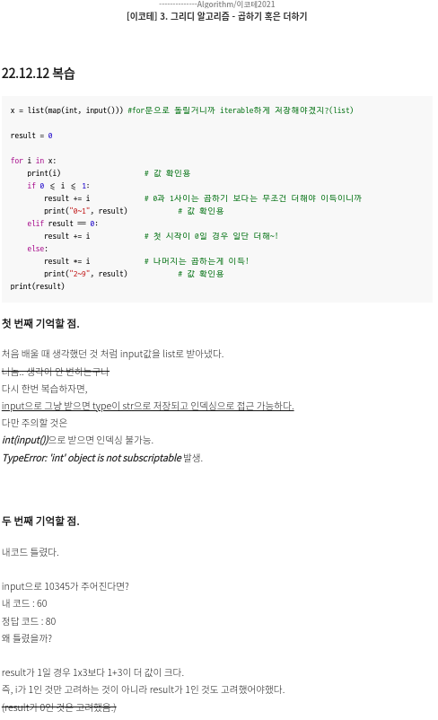

#### should do
1. mAP 포스팅 마무리
2. IoU 포스팅 마무리 (그림 부분만 수정할 것)
3. 이코테 구현 파트 포스팅하기

   
### 12/9 (금)
--- 
#### already did
1. mAP 포스팅 2/3 완료
   - 아무 것도 모르는 사람에게 설명한다고 생각하고 글 적으니까 엄청 길어짐..
   - 그리고 뭔가 두서없이 적히는 듯
2. Detectron2 AR_CMS_RH Dataset 각 class별 객체 수 뽑아내는 중.
 

#### should do
1. mAP 포스팅 (이번 주 내로)
2. IoU 포스팅 (그림 부분만 수정할 것)

   
### 12/8 (목)
--- 
#### already did
1. mAP 포스팅 시작
2. IoU 포스팅 수정 (그림 해야됨)
 

#### should do
1. mAP 포스팅 (이번 주 내로)
2. IoU 포스팅 (그림 부분만 수정할 것)

   
### 12/7 (수)
---

#### already did
1. 터미널로 Detectron2 구동 할 수 있도록 PyCharm기반 세팅해보기 / **Complete, Customdemo.py Run시키면 됨**
   - argparse 공부
2. Detectron2 기반 6Classes 객체 수 검출 결과 공유 완료
 

#### should do
1. mAP 포스팅 (이번 주 내로)
2. IoU 포스팅 (그림 부분만 수정할 것)
3. 터미널로 Detectron2 구동 할 수 있도록 PyCharm기반 세팅해보기
   - argparse 공부

   
### 12/6 (화)
---

#### already did
1. IoU 포스팅 (그림 부분 빼고)

 

#### should do
1. mAP 포스팅 (이번 주 내로)
2. IoU 포스팅 (그림 부분만 수정할 것)

   
### 12/5 (월)
---

#### Detectron2 Detection
1. ~~AR CMS Dataset월/221124/LH *.MP4 File detection~~ ***complete***
2. ~~각 동영상의 Class 갯수를 프레임 누적을 통해서 Count 하는 방법 찾는 중~~ ***complete***
3. ~~각 동영상의 Class 갯수를 프레임 누적을 통해서 Count + text file로 저장하는 방법 찾는 중~~ ***complete***
    - 그러나, text file이 1epoch가 돌 때마다 텍스트를 "추가"하는 것으로 세팅했다고 생각했는데, text file이 갱신되는 현상 진행중.
      - 추후에 detectron2 다시 사용할 때 꼭 고려해서 수정할 것.

#### 상준 선임님께 보고하기 (보고 후 대기)
#### mAP, IoU 블로그 포스팅하기 (포스팅 중)

   
### 12/2 (금)
---

#### Detectron2 Detection
1. ~~AR CMS Dataset/221124/LH *.MP4 File detection~~ ***complete***
2. ~~각 동영상의 Class 갯수를 프레임 누적을 통해서 Count 하는 방법 찾는 중~~ ***complete***
3. 각 동영상의 Class 갯수를 프레임 누적을 통해서 Count + text file로 저장하는 방법 찾는 중
   - Custom Class index (총 6Class)
     - 0 = person
     - 1 = bicycle
     - 2 = car
     - 3 = motorcycle
     - ~~4 = airplane~~
     - 5 = bus
     - ~~6 = train~~
     - 7 = truck

   
### 12/1 (목)
---

#### Detectron2 Detection
1. ~~AR CMS Dataset/221124/LH *.MP4 File detection~~ complete
2. 각 동영상의 Class 갯수를 프레임 누적을 통해서 Count 하는 방법 찾는 중

   
## Nov.
### 11월 한줄 요약 : FER Custom Dataset 네트워크 별 학습 및 정확한, 신속한 학습을 위한 실험 진행

   

### AR_CMS_Dataset Detectron

왼쪽 detection box, 오른쪽 segment   
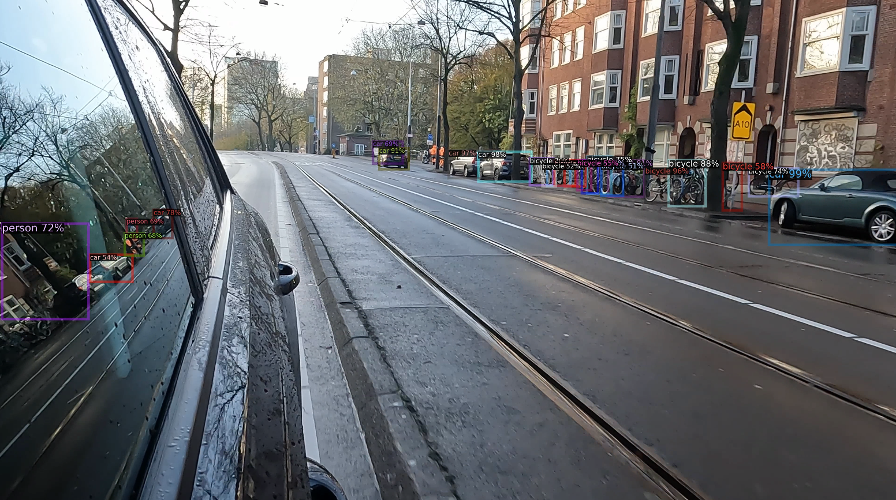
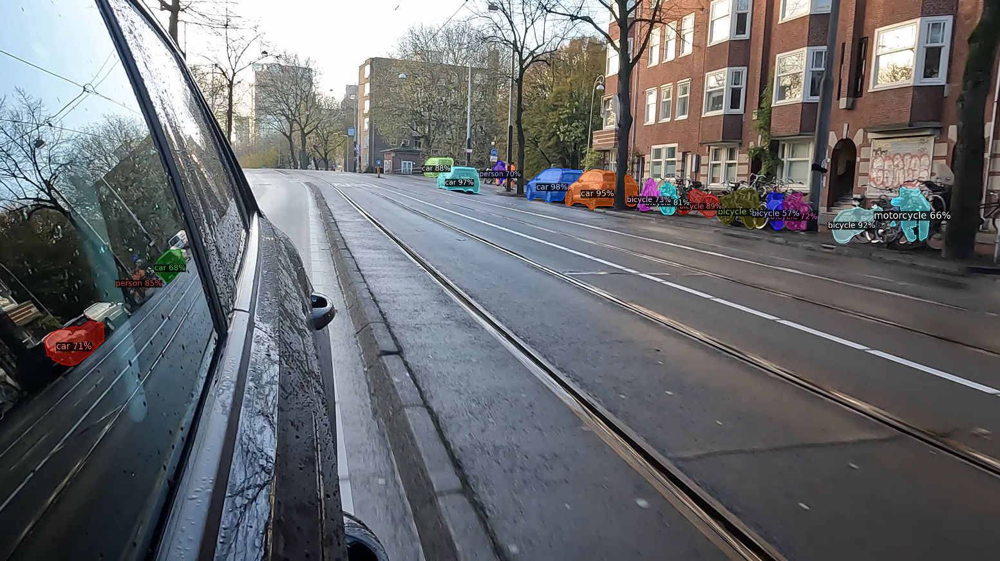

   

### 네크워크 별 성능비교
|Model|FLOPs|Params|Total Epoch|val Acc (Epoch)|Total hour(h)|TestDataset|
|--|--|--|--|--|--|--|
|VggNet|15.48 G|138 M|17|29.1 % (2)|298|AffectNet-8|
|ResNet|3.86 G|23 M|128|43.9 % (14)|134|AffectNet-8|
|MobileNet|0.53 G|3.2 M|200|45.2 % (33)|47|AffectNet-8|

네트워크 별 학습 그래프

vgg, resnet, mobilenet순서   

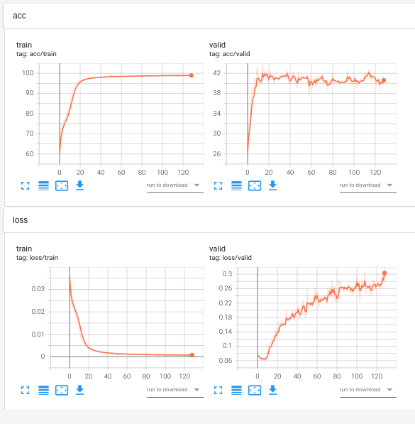
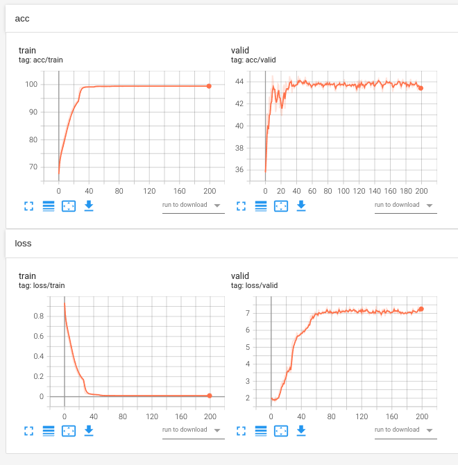
    
    vgg 재학습 후 고쳐야됨

   

### init 통째로 vs getitem 차례로 "결론"

|목차|init|getitem|차이|
|--|--|--|--|
|train_loader 학습 부분 1 epoch당 걸린 시간|40분 20초|41분 40초|1분 20초|
|dataset class 변수에 담는 부분 걸린 시간|29.9분|10초|29.8분|

파일 경로

 

`Internship/ResNet_FER/[11.24][ getitem차례로 ] ResNet.ipynb`  
`Internship/ResNet_FER/[11.24][ init통째로 ] ResNet-dataloader부분 시간계산비교.ipynb`  

   

### 날짜별 정리

11월 날짜별 자세히 보기

   
### 11/30 (수)
---

#### Detectron2 Detection

 

1. AR CMS Dataset/221124/LH *.MP4 File Dectection부분만 진행(상준 선임님) ~~완료~~
    - Segmentation 말고.
    - 일단 1~2개 영상만 먼저 해보기.   
 
    
`cd demo/`
     
`python demo.py --config-file ../configs/COCO-InstanceSegmentation/mask_rcnn_R_50_FPN_3x.yaml \
  --input input1.jpg input2.jpg \
  [--other-options]
  --opts MODEL.WEIGHTS detectron2://COCO-InstanceSegmentation/mask_rcnn_R_50_FPN_3x/137849600/model_final_f10217.pkl`
 여기 위에부분 좀 고쳐서 돌리면 아래 그림 나옴.

    
    
  
    

왼쪽 detection box, 오른쪽 segment   

 
2. 아래 class만 남기고 나머지 제외 + Frame Count로 class별 총 갯수 txt로 추출하기. 

    - bicycle, person, car, bus, motorcycle, truck

    
   
### 11/29 (화)
---

#### detectron2

 

1. AR CMS Dataset/221124/LH *.MP4 File Detection부분만 진행(상준 선임님)
    - Segmentation 말고.
    - 일단 1~2개 영상만 먼저 해보기.
    
    
    
    
    
    
    
    
    
    
    
    
    

   
### 11/28 (월)
---

#### init 통째로 vs getitem 차례로 "결론"

|목차|init|getitem|차이|
|--|--|--|--|
|train_loader 학습 부분 1 epoch당 걸린 시간|40분 20초|41분 40초|1분 20초|
|dataset class 변수에 담는 부분 걸린 시간|29.9분|10초|29.8분|

1. train_loader 부분 1 epoch당 약 `1분 20초` 정도 차이남.
2. dataset class 부분 약 `29.8분` 정도 차이남.
3. 학습 도중 정지 시키고 `jupyter notebook` 껏다 키니까 `tqdm` 다시 확인 못한다!!

파일 경로

 

`Internship/ResNet_FER/[11.24][ getitem차례로 ] ResNet.ipynb`  
`Internship/ResNet_FER/[11.24][ init통째로 ] ResNet-dataloader부분 시간계산비교.ipynb`  

#### jupyter notebook에서 cv2.imshow()쓰면 kernel died !!
    대신 `from matplotlib import pyplot as plt`을 써야한다.
    

   
### 11/25 (금) 연차
    ***대학연합특허셀럽캠프 장려상 !!***   
    ***연차 쓴 보람이 있다 !!***

   
### 11/22(화), 11/23(수), 11/24(목)
---

#### 월요일 민규사원님 Feedback 4번
4. Dataloader부분, 아래의 1, 2의 시간 비교 해봐라
    1. init에서 통째로 load
        - class로 불러오는 곳 위 아래에 time 측정해서 정리하고 보여드리기
        1. train_set(28만 장)은 Kernel Dead, val_set(4천장)은 정상작동 가능 확인 (11/23(수))
            - Kernel Dead 타개를 위한 조치사항 ~~(아래를 해도 커널 계속 죽음)~~
                1. [c.NotebookApp.max_buffer_size =10000000000](https://min23th.tistory.com/11)
                2. [limit 500000수정](https://blog.hbsmith.io/too-many-open-files-%EC%97%90%EB%9F%AC-%EB%8C%80%EC%9D%91%EB%B2%95-9b388aea4d4e)
                    

                    
/etc/security/limits.conf

                    
                     
    
                    `* hard nofile 500000`  
                    `* soft nofile 500000`  
                    `root hard nofile 500000`  
                    `root soft nofile 500000`  
                    

                3. if문으로 7만장 단위로 쪼개도 안됨.
                    

                    
free -mh 명령어 수행 결과

                     

                    ***평상 시***

                    |목차|total|used|free|shared|buff/cache|available|
                    |--|--|--|--|--|--|--|
                    |Mem|15 G|1.0 G|14 G|5.5 M|400 M|14 G|
                    |Swap|2.0 G|1.6 G|406 M|/|/|/|

                     

                    ***Dead kernel***

                    |목차|total|used|free|shared|buff/cache|available|
                    |--|--|--|--|--|--|--|
                    |Mem|15 G|15 G|141 M|8.9 M|98 M|18 M|
                    |Swap|2.0 G|2.0 G|0 B|/|/|/|
                    

                4. ***다른 방법이 있는지 여쭤보기.***
                    - 이미지 init에서 불러오는게 28만장이라서 안되는 것 같다라고 말씀드리자 메모리 때문에 당연한거라고 하심.
                    - ~~(그럼 난 뭘하고 있던건지..?)~~
                    - 그래서 np.load만 init에서 진행해보라 하심.
                    - 즉, annotation npy file만 init에서 통째로 로드 하고 train코드에서 걸리는 시간 얼마나 줄어드는지(1), Dataset class load시 얼마나 걸리는지(2) 체크해서 말씀 드리기.
        
        2. init에서 label load 코드 정상 작동 확인 (11/24(목))
            - 그러나, getitem 차례로 load(134h), init 통째로 load(143h)으로 측정 되므로 `코드 검토` 및 `tqdm` 활용법 확인 중.
            - `tqdm` 활용법 숙지 완료.
            - 코드 수정을 통한 143h -> 137h로 성능 확보 but, 134시간 보다 단축될 수 있을 것으로 예상하기 때문에 아래 조치 중.
                1. 현재 num_workers 0으로 수정된 부분 확인 -> 2로 다시 고정(동일환경구축)
                2. `for step, batch in tqdm(enumerate(train_loader), desc="train_loader 1epoch"):`
                    - train_loader부분 집중적으로 보기 위한 tqdm설정.
                    - init통째로 vs getitem차례로 1epoch당 시간 측정중
                
                
                
     2. getitem에서 차례로
        - `tqdm` 라이브러리 사용법 익혀서 1 epoch당 걸리는 시간 측정해서 정리하고 보여드리기
            

   
### 11/21(월)
---

#### 0. 잘 그려진 학습 그래프 + 표 정리하기 ==> 진행중
- valid loss 그래프 값들 튀는 이유 발견(`logit.max(1)`) ==> 아닐 수 도 있지만 유력해보임.
- 11/18 학습 중이던 vgg 그래프 이상 ==> 이유 찾아내고 재학습 필요함.

#### 1. loss 먼저 넣고 backward+step vs backward+step후 loss의 차이점을 찾아보라. ==> ~~완료(?)~~

#### 2. 11/14(월) 민규 사원님 Feedback의 결과에 대한 Feedback

1. loss 먼저 넣고 backward+step vs backward+step후 loss의 차이점을 찾아보라. ==> 완료
    - ***민규 사원님이 전달하고자 했던 메세지***
        - `학습(backward+step)을 다 시키고 loss를 출력하는 것 보다, loss를 다 출력하고 학습을 시키는 것이 더 정석이다.`
        - 크게 의미는 없지만, 정석? 관례?를 알려줄려고 했던 Feedback.

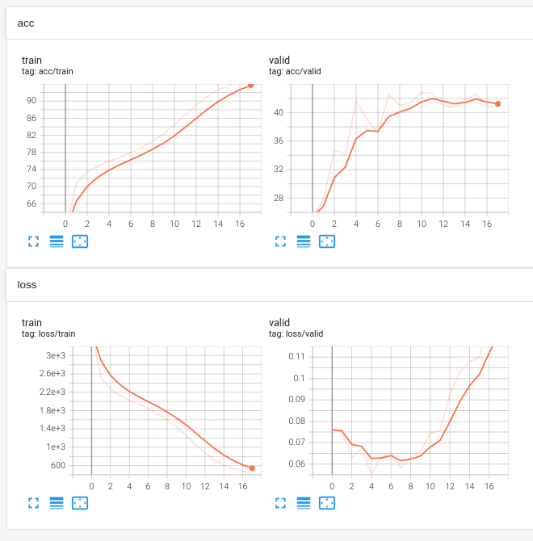
  
차이는 없는듯 보임.

- 이 항목도 다 됬다고 생각했는데...
    - `logit.max(1)` 이거 때문에 valid loss 값이 튀므로 다시 재학습해야 될 수도 있음.
    - 일단 해놨으니까, 해놓은 부분까지 정리 해놓겠음.
        - 경로 : "Internship/ResNet_FER/[11.17][loss.item()->train_loss 수정본][11.15][backward후 loss접근, Bad 예상] ResNet.ipynb"
        - 경로 : "Internship/ResNet_FER/[11.18][loss접근 후 backward+step] ResNet.ipynb"

    
2. train_loss_visual = loss.item() 이 아니라, = train_loss다. 고쳐라. ==> ~~완료~~
    - train loss 관련 추가된 사항.
        - `train_loss / batch[1].size(0)`이 아니라, `train_loss / total_cnt` 아닌지? ==> ㅇㅇ맞아.

3. 학습 시키고 valid loss 차이점 체크해봐라(because 원인 미상) ==> ~~아직도 모르겠음. valid 데이터셋 라벨링이 잘못된 것 때문인 것으로 추정됨.~~   
여하튼 1~3번 피드백이 찝찝하게 끝남. 지금 code 전체 수정하고 다시 물어봐야됨.
4. Dataloader부분, 아래의 1, 2의 시간 비교 해봐라
    1. init에서 통째로 load
        - class로 불러오는 곳 위 아래에 time 측정해서 정리하고 보여드리기
    2. getitem에서 차례로
        - `tqdm` 라이브러리 사용법 익혀서 1 epoch당 걸리는 시간 측정해서 정리하고 보여드리기

   
### 11/18(금)
---

#### 0. Conv2d 실습
- 참고자료 :
    - https://gaussian37.github.io/dl-pytorch-conv2d/
    - [[딥러닝 일지] Conv2d 알아보기](https://blog.joonas.io/196?category=1016329)
- VGG code review.ipynb file 참고

#### 1. loss 먼저 넣고 backward+step vs backward+step후 loss의 차이점을 찾아보라. ==> 진행 중.
- 경로 : "Internship/ResNet_FER/[11.18][loss접근 후 backward+step] ResNet.ipynb"
#### 2. 잘 그려진 학습 그래프 + 표 정리하기 ==> 진행중
- 지금 vgg만 있으면 되기 때문에 vgg학습중 (11/18)
- 월요일에 출근해서 vgg 학습된거 확인하고 학습 그래프+표 정리 해내기.

   
### 11/17(목)
---

  

#### 나는 Conv2d안에 숫자의 의미를 잘 모르며, 실습해보면서 output찍어봐야할 것 같다.
- 참고자료 : https://gaussian37.github.io/dl-pytorch-conv2d/
- VGG code review.ipynb file 참고

  

#### 11/17 발견사항 + 11/15 실험을 통해 알게된 부분 결론.
결론 : `step, batch For문이 아니라 Epoch for문에 tensorboard writer가 있어야한다.`

  

#### 11/17 발견사항 : 현재 실험 코드 차질 생김
[backward후 loss접근, Bad 예상+tensorboard for문안으로] ResNet.ipynb"   
[backward후 loss접근, Bad 예상] ResNet.ipynb"   
위 코드 파일 둘다 train_loss로 바꿔서 학습시켜야 했는데.,,,,,   
기존에 loss.item()으로 진행함...ㅠ...   
안돼ㅐㅐㅐㅐㅐ (~~다시 학습중.. // 11.18 학습 완료~~)

더보기(결과 그래프)

<!-- summary 아래 한칸 공백 두어야함 -->
### 왼쪽(Epoch for문 안에 writer), 오른쪽(step, batch for문 안에 writer)

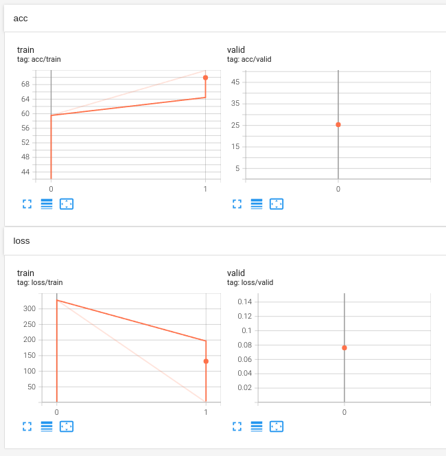

- Epoch for문 안에 writer 학습 코드 경로 : 
    - "Internship/ResNet_FER/[11.17][loss.item()->train_loss 수정본][11.15][backward후 loss접근, Bad 예상] ResNet.ipynb"   
- step, batch for문 안에 writer 학습 코드 경로 : 
    - "Internship/ResNet_FER/[11.17][loss.item()->train_loss 수정본][11.15][backward후 loss접근, Bad 예상+tensorboard for문안으로] ResNet.ipynb" 

  

#### 11/15 실험을 통해 알게된 부분.
1. ***step, batch For문 안에 writer*** VS ***Epoch For문 안에 writer***
    - step, batch For문이 아니라 Epoch for문에 tensorboard writer가 있어야한다.

더보기(결과 그래프)

<!-- summary 아래 한칸 공백 두어야함 -->
### 왼쪽(Epoch for문 안에 writer), 오른쪽(step, batch for문 안에 writer)

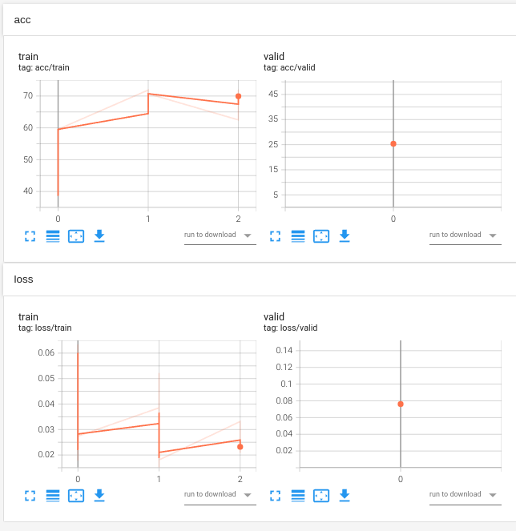

- Epoch for문 안에 writer 학습 코드 경로 : 
    - "Internship/ResNet_FER/[11.15][backward후 loss접근, Bad 예상] ResNet.ipynb"   
- step, batch for문 안에 writer 학습 코드 경로 : 
    - "Internship/ResNet_FER/[11.15][backward후 loss접근, Bad 예상+tensorboard for문안으로] ResNet.ipynb" 

   
### 11/15(화)
---
#### 상준 선임님 과제
1. MobileNet Epoch 끝까지 돌려서 보고하기. ***~~(11/18. 학습 끝)~~***

더보기(결과 그래프)

<!-- summary 아래 한칸 공백 두어야함 -->
### MobileNet

    
- 학습 코드 경로 : 
    - "Internship/MoblieNet_FER/[11.15][상준선임님 과제] MobileNet.ipynb"   

    
    
   
### 11/14(월)
---
#### 민규 사원님 Feedback   

1. loss 먼저 넣고 backward+step vs backward+step후 loss의 차이점을 찾아보라. ==> 11.18 진행 중.
2. train_loss_visual = loss.item() 이 아니라, = train_loss다. 고쳐라. ==> ~~완료~~
3. 학습 시키고 valid loss 차이점 체크해봐라(because 원인 미상) ==> 아직도 모르겠음. valid 데이터셋 라벨링이 잘못된 것 때문인 것으로 추정됨.
4. Dataloader부분, 아래의 1, 2의 시간 비교 해봐라 ==> 민규 사원님 출근하면 물어보기
    1. init에서 통째로 load
    2. getitem에서 차례로

더보기(결과 그래프)

<!-- summary 아래 한칸 공백 두어야함 -->
### "1 번 Feedback"의 결과

### "2 번 Feedback"의 결과
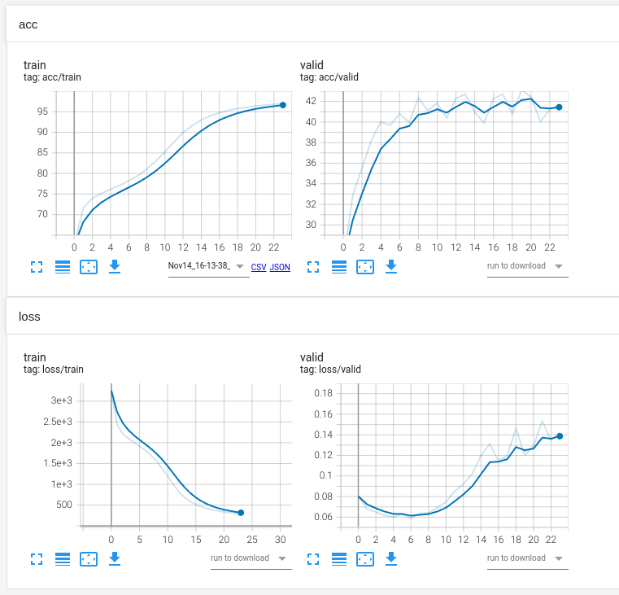 

긋긋긋 ~!   
vgg, resnet, mobilenet 모두 고침.

   
### 11/11(금), 11/14(월)
---
|Model|FLOPs|Params|TestDataset|Total Epoch|val Acc (Epoch)|train Acc|총 학습 시간(h)|
|--|--|--|--|--|--|--|--|
|VggNet|15.48 G|138 M|AffectNet-8(상명대, 8-Labels)|17|29.1 % (2)|70.1 %|298|
|ResNet|3.86 G|23 M|AffectNet-8(상명대, 8-Labels)|35|43.9 % (15)|98.3 %|134|
|MobileNet|0.53 G|3.2 M|AffectNet-8(상명대, 8-Labels)|10|42.9 % (9)|- %|47|
|MobileNet|0.53 G|3.2 M|AffectNet-8(상명대, 8-Labels)|200|45.2 % (33)|95.9 %|47|

더보기(결과 그래프)

<!-- summary 아래 한칸 공백 두어야함 -->
### VggNet, ResNet, MobileNet 순서

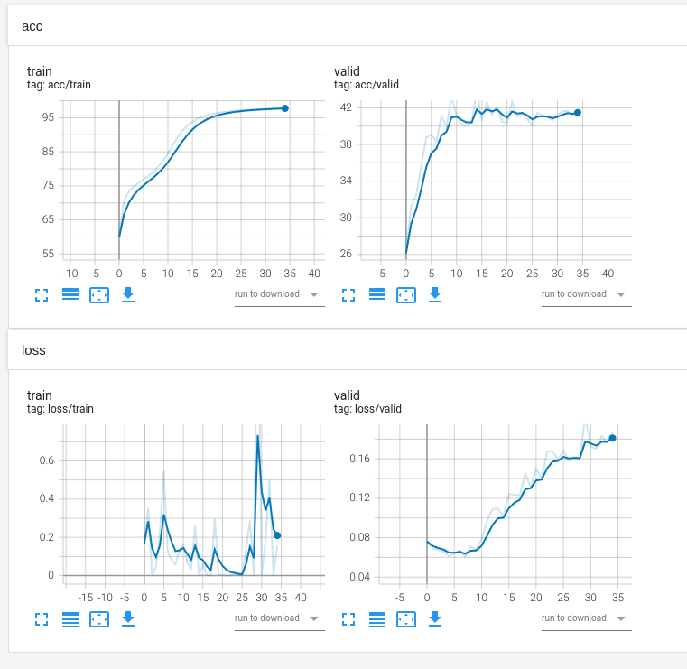
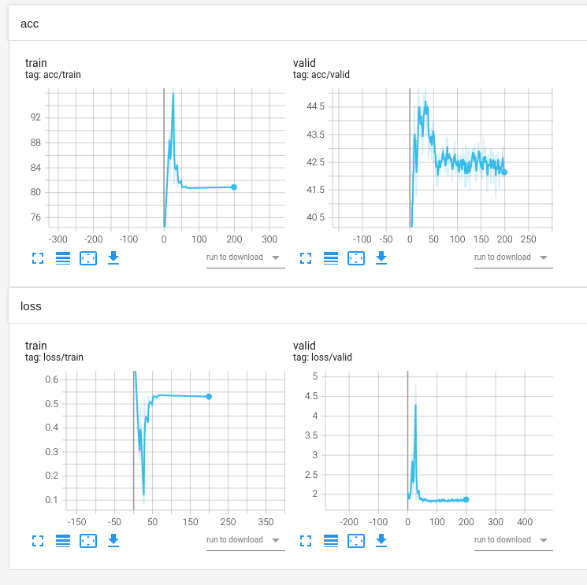

 
    
### 11/15(화) 그래프 이상한 원인 확인.
1. train, valid loss 관련,
    - 학습은 잘 됬지만,, 그래프로 시각화 할 때 내가 잘못한 부분 :
        - `train_loss_visual = loss.item()` 부분 잘못 함. ==> `loss.item()`이 아니라, `train_loss`임. 

2. MobileNet train, val loss + acc 관련,
    - 모바일 넷 그래프를 보면, 혼자 이상한 그래프를 그리고 있다.
    - 코드가 다르기도 하지만, 가장 큰 이유는, learning rate scheduler에서 patience를 너무 낮게 설정해서 lr이 낮아졌고, 그 결과 그래프가 이상하게 나왔다.
    
  

- VggNet 파일 위치 : 
    - "Internship/VGG_FER/[11.11][tensorboard, 17에폭, valid acc 29%] VGG.ipynb"
- ResNet 파일 위치 : 
    - "Internship/ResNet_FER/[11.11][tensorboard, 35에폭, valid acc 43%] ResNet.ipynb"   
- MobileNet 파일 위치: 
    - "Internship/MobileNet_FER/[11.11][tensorboard, 200에폭, valid acc 45.2%] MobileNet.ipynb"

   
### 11/09(수), 11/10(목)   
---
현업에서 성능평가 진행시 아래 표와 같이 정리하여 보고한다. 
|Model|FLOPs|Params|Accuracy(%)|TestDataset|
|--|--|--|--|--|
|EmoNet|16.94G|14 M|75.89|AffectNet-8(상명대, 8-Labels)|
|VggNet|---.---G|-- M|--.--|AffectNet-8(상명대, 8-Labels)|
|ResNet|---.---G|-- M|--.--|AffectNet-8(상명대, 8-Labels)|
 
따라서, 내가 할 일은 아래와 같다. 
1. tensorboard를 활용한 실시간 데이터 학습 점검하는 방법 숙지 
2. Model, FLOPs, Params, Accuracy, TestDataset 작성해보기   

     

    

## Oct.

### 10월 한줄 요약 : 현대자동차 'CNN이란 무엇인가?' PPT 제작 및 Pytorch CIFAR10 실습

더보기(버전 정리)

<!-- summary 아래 한칸 공백 두어야함 -->
목표 : 15333   
torch vision mnist dataset 불러오기   
classification cifar-100   

10/19(수) 아래 유튜브 정독 완료.   
https://www.youtube.com/watch?v=WjkXTZK3P0A&list=PLHOsBEAyYj3xf4i20sCA5o8MgVW5sIiHD&index=16

10/20(목) 유튜브 실습 + dataload + 전처리 포스팅하기.   

     

## Sep.

### 9월 한줄 요약 : SL Cloud 자료 정독 및 개발 환경 세팅

더보기(버전 정리)

<!-- summary 아래 한칸 공백 두어야함 -->
* env py3.6 version 정리
    - torch : 1.10.0
    - 파이참 터미널 cuda : 9.1.85
    - 로컬 터미널 cuda : 10.2.89

* env py3.7 version 정리
    - torch : 1.7.0
    - 파이참 터미널 cuda : 9.1.85
    - 로컬 터미널 cuda : 10.2.89

     

## 조현근 선정 참고자료
[옵티마이저에 대한 좋은 고찰](https://pozalabs.github.io/Optimizer/)   
[Learning Rate Scheduler에 대한 Skill](https://gaussian37.github.io/dl-pytorch-lr_scheduler/)
