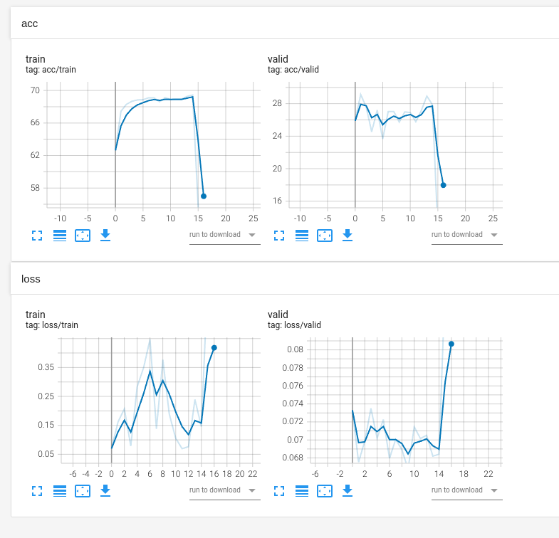

# This repository is a TIL created during an internship at [SL Corporation](http://www.slworld.com/).

## Sep

* env py3.6 version 정리
    - torch : 1.10.0
    - 파이참 터미널 cuda : 9.1.85
    - 로컬 터미널 cuda : 10.2.89

* env py3.7 version 정리
    - torch : 1.7.0
    - 파이참 터미널 cuda : 9.1.85
    - 로컬 터미널 cuda : 10.2.89
    
    

## Oct

목표 : 15333   
torch vision mnist dataset 불러오기   
classification cifar-100   

10/19(수) 아래 유튜브 정독 완료.   
https://www.youtube.com/watch?v=WjkXTZK3P0A&list=PLHOsBEAyYj3xf4i20sCA5o8MgVW5sIiHD&index=16

10/20(목) 유튜브 실습 + dataload + 전처리 포스팅하기.   

## Nov

### 11/09(수), 11/10(목)   

1. tensorboard를 활용한 실시간 데이터 학습 점검   
2. Model, FLOPs, Params, Accuracy, TestDataset 작성하기.   

|Model|FLOPs|Params|Accuracy(%)|TestDataset|
|--|--|--|--|--|
|EmoNet|16.94G|14 M|75.89|AffectNet-8(상명대, 8-Labels)|
|VggNet|---.---G|-- M|--.--|AffectNet-8(상명대, 8-Labels)|
|ResNet|---.---G|-- M|--.--|AffectNet-8(상명대, 8-Labels)|

### 11/11(금). 11/14(월)

|Model|FLOPs|Params|TestDataset|Total Epoch|val Acc (Epoch)|train Acc|MaxEpoch 걸리는 시간(h)|
|--|--|--|--|--|--|--|--|
|VggNet|15.48 G|138 M|AffectNet-8(상명대, 8-Labels)|17|29.1 % (2)|70.1 %|298|
|ResNet|3.86 G|23 M|AffectNet-8(상명대, 8-Labels)|35|43.9 % (15)|98.3 %|134|
|MobileNet|0.53 G|3.2 M|AffectNet-8(상명대, 8-Labels)|10|42.9 % (9)|- %|47|
|MobileNet|0.53 G|3.2 M|AffectNet-8(상명대, 8-Labels)|200|45.2 % (33)|95.9 %|47|

결과 그래프

<!-- summary 아래 한칸 공백 두어야함 -->
##### VggNet

- VggNet 경로 : 
    - "Internship/VGG_FER/[11.11][tensorboard, 17에폭, valid acc 29%] VGG.ipynb"
- ResNet 경로 : 
    - "Internship/ResNet_FER/[11.11][tensorboard, 35에폭, valid acc 43%] ResNet.ipynb"   
- MobileNet 경로 : 
    - "Internship/MobileNet_FER/[11.11][tensorboard, 200에폭, valid acc 45.2%] MobileNet.ipynb"   

### 11/14(월)

#### 민규 사원님 Feedback   
---
1. loss 먼저 넣고 backward+step vs backward+step후 loss의 차이점을 찾아보라.
2. train_loss_visual = loss.item() 이 아니라, = train_loss다. 고쳐라.
3. 학습 시키고 valid loss 차이점 체크해봐라(because 원인 미상)
4. Dataloader부분, 1, 2의 시간 비교 해봐라
    1. init에서 통째로 load
    2. getitem에서 차례로

---

## 조현근 선정 참고자료
---
[옵티마이저에 대한 좋은 고찰](https://pozalabs.github.io/Optimizer/)   
[Learning Rate Scheduler에 대한 Skill](https://gaussian37.github.io/dl-pytorch-lr_scheduler/)
